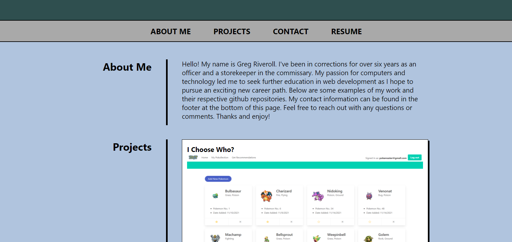

# Advanced CSS

## Website Link
[Portfolio](https://griveroll86.github.io/portfolio/)

## Portfolio

This assignment asked us to create a portfolio using CSS that included our name, an image/avatar of us and a navigation bar that moves the browser to "About Me", "Work", and "Contact" sections on the page. The work/applications section had to include one project larger than all the others. The entire page needed to be responsive in various browsers and screen sizes.

## Files Edited
* index.html
* reset.css
* style.css

## Website Preview
